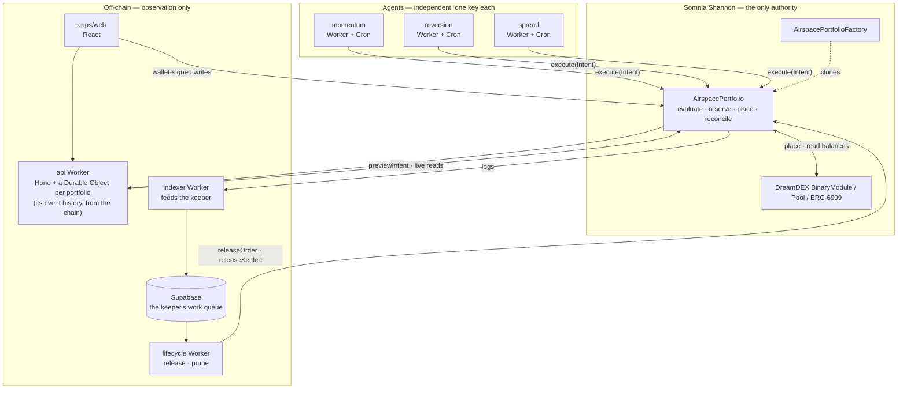
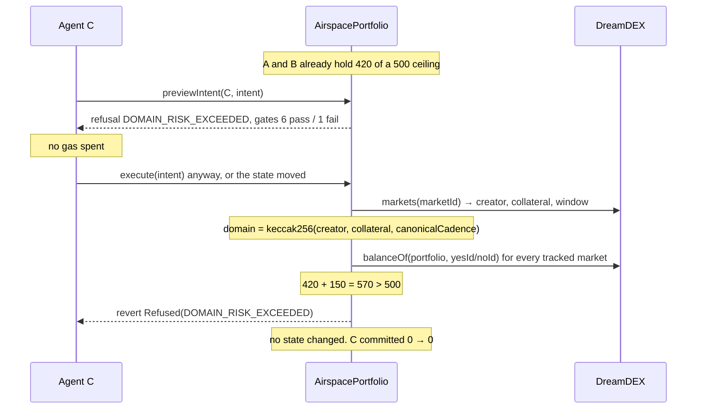
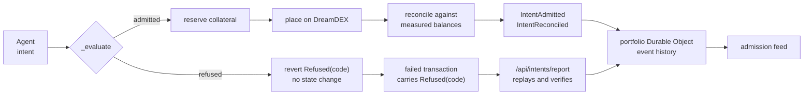

# Architecture

AIRSPACE is one contract that decides, and a stack around it that watches. The
split is absolute: nothing outside the contract can admit, refuse, or move
capital. Everything outside it exists so a person can see what the contract did.

---

## The layers



Two arrows carry authority: an agent calling `execute`, and an owner's wallet
calling a policy or recovery function. Every other arrow is a read. The web app
reads nothing from a database: what it shows is decoded from the portfolio's own
logs and re-measured against the contract.

---

## The admission decision

This is the product. Everything else is scaffolding around it.



Seven gates, evaluated in order, short-circuiting at the first failure:

| # | Gate | Asks |
| --- | --- | --- |
| 1 | Agent policy | registered, enabled, off cooldown, nonce fresh, within its own limits |
| 2 | Market trading | not finalized, not resolved, not voided, inside its window |
| 3 | Market generation | the pool's `marketNonce` still matches the intent's |
| 4 | Tick / lot | price on tick, quantity on lot, above minimum |
| 5 | Price ceiling | inside both the global and the agent's price band |
| 6 | Market headroom | enough time left before expiry |
| 7 | **Portfolio domain** | **would this breach a ceiling shared with every other agent** |

Gates 1–6 are about the intent. Gate 7 is about everyone else. A refusal at gate 7
is the only one an agent cannot avoid by writing better code, and it is what
AIRSPACE exists to produce.

The bitmask the contract returns is what the web app renders. Gates after the
blocking one were never evaluated and are shown as "not reached", not as failures.

---

## The contract

`contracts/src/AirspacePortfolio.sol` — 23,689 bytes of runtime, 887 under the
EIP-170 limit.

```
execute(Intent)
  ├─ nonReentrant                       EIP-1153 transient lock
  ├─ e = _evaluate(msg.sender, intent)  the single source of truth
  ├─ if refused → revert Refused(code)  no state touched
  ├─ agentNonce = intent.nonce          replay closed before any external call
  ├─ _commitReservation(agent, i, e)    capital held for what the order will need
  ├─ _place(i, e) → orderId, ExecCtx    pre-balances captured before the venue call
  └─ _reconcile(...)                    measured fills, resting remainder, release
```

`_evaluate` is a non-reverting view. `previewIntent` returns it as a slim
`AdmissionView`; `execute` reverts on its refusal code. One implementation, two
callers — see [DECISIONS.md](DECISIONS.md#4-one-evaluation-path-used-by-both-the-gate-and-the-display).

### Risk domains

```
domain = keccak256(creator, collateral, canonicalCadence)
```

All three inputs are read from the DreamDEX registry during the same call that
uses them. A market minted one second ago lands in the right domain with no owner
transaction and no configuration. This is a **cadence** domain and never an asset:
sibling BTC and ETH 15-minute series from one creator share a ceiling by design,
which is stated in the UI. See
[DECISIONS.md](DECISIONS.md#1-the-risk-domain-is-a-cadence-not-an-asset).

### How exposure is counted

A market is not one number. It is an INTERVAL of positions the portfolio could
reach, and the risk is the widest point of it.

Realized holdings come from ERC-6909 balances at evaluation time. Each resting
order then widens exactly one bound, because each resolves independently:

```
b  = bal(YES) − bal(NO)              what is held right now
up = b + yesLong + yesShort          BUY_YES fills / SELL_YES escrow returns
dn = b − noLong  − noShort           BUY_NO  fills / SELL_NO  escrow returns

worstCase = max(|up|, |dn|)
```

A SELL escrows its outcome tokens at placement, not at fill — verified live,
where each pool's outcome balance equalled its resting ask depth exactly. So a
resting sell has already left `bal`, and what it exposes is the escrow returning
if it is cancelled.

Realized YES and NO net: a held complete set pays one unit whichever way the
market resolves, so it carries no direction. Pending orders never net. A pending
BUY_YES and a pending BUY_NO can each fill without the other, and treating them
as cancelling is what made version 1.0.0 unsafe — see
[SECURITY.md](SECURITY.md#the-safe-overstatement-invariant).

Across a domain, exposure is the **gross** sum of per-market worst cases — never
netted between markets. Two markets sharing a cadence domain establish no payoff
equivalence, so being long one series and short another is two positions, not
zero.

Nothing is accumulated in a counter; see
[DECISIONS.md](DECISIONS.md#2-exposure-is-measured-never-accumulated).

The whole model is implemented a second time, independently and by a different
method, in [`contracts/test/reference/ExposureOracle.sol`](contracts/test/reference/ExposureOracle.sol),
which enumerates all sixteen fill combinations rather than evaluating a bound.
Tests assert the contract never reports below it.

### Lifecycle, all permissionless

`releaseOrder`, `releaseSettled` and `pruneMarket` are callable by anyone and
prove their claim against the venue before freeing anything. A keeper is a
convenience, not a dependency: a stuck reservation overstates usage, which is the
safe direction, and any party can clear it.

---

## Off-chain

### `workers/indexer`

Cron every minute. Reads the current factory's portfolio logs and writes the tables
the lifecycle keeper plans from. The web app does not read them.

Idempotent by construction: every log lands in `chain_events` keyed by
`(chain_id, tx_hash, log_index)`. A replayed block, a retried cron, a duplicate
delivery and a reorg re-scan all converge on the same rows — a duplicate key means
the projection is already applied, so it is skipped rather than repeated.

Logs are processed strictly in `(block, logIndex)` order, because `IntentAdmitted`
carries the order id and `IntentReconciled` carries what actually filled, and they
arrive in that order in one transaction.

Positions are **re-read from the contract** rather than derived from event
arithmetic, mirroring the contract's own measured-not-accumulated rule.

### `workers/api`

Hono on Workers, with one Durable Object per portfolio. It holds no credentials and
touches no database. The DO does two jobs.

**Live state.** A 15-second snapshot served over a WebSocket. On RPC failure it
serves its last good snapshot tagged `stale: { since, reason }`, and the UI says
"Delayed — showing last known state" rather than showing a stale number as if it
were live. The domains it covers include every domain the portfolio has configured,
taken from its own logs, so a series that rolled away never hides an enforced
ceiling.

**The event history.** It decodes the portfolio's own logs into a persisted store
and derives every list from it: agents, activity, receipts, reservations,
positions, reconciliation. Events say what was opened and released; what is true
now is re-read from the contract (`orderRec` against the venue's order for
reservations, the outcome token's balances for positions). A portfolio deployed
long ago reads its history in bounded steps driven by the DO's alarm, and every
response says whether the history is complete. A step that fails is retried, never
skipped. See [DECISIONS.md](DECISIONS.md#19-the-app-reads-the-chain-not-a-database).

`POST /api/intents/simulate` calls the contract's `previewIntent`. It does not
re-implement a single check.

`POST /api/intents/report` recovers a refusal from a failed transaction. It takes
only a hash and verifies everything against the chain — see
[DECISIONS.md](DECISIONS.md#7-intentrefused-is-unreachable-and-refusals-are-recovered-from-failed-transactions).

No endpoint can move capital or change a policy. There is no backend key with
owner authority.

### `workers/lifecycle`

Cron scans for releasable work and enqueues it; a queue consumer executes it with
retry and a dead-letter queue. Terminal refusals — `OrderStillLive`,
`NothingToRelease`, `MarketNotSettled`, `MarketStillActive`, `NotTracked` — are
successes, not failures: they mean another caller got there first.

The scan covers only the current factory's portfolios, finishes inside a fixed time
and job budget so scans cannot overlap, and skips work already queued or recently
finished. A job that never runs expires, and a reservation the contract has no
record of is retired rather than re-examined every minute. See
[DECISIONS.md](DECISIONS.md#19-the-app-reads-the-chain-not-a-database) for what
happened when it did not.

### `workers/agent`

Three deployments, three keys, three KV namespaces, no shared state. They discover
markets from the DreamDEX registry rather than from the AIRSPACE indexer, so an
agent keeps trading when this backend is down. See
[docs on the agents](workers/agent/README.md).

### Supabase

Fourteen tables, used only by the lifecycle keeper to plan work. RLS allows
anonymous reads of chain-derived tables and no writes at all; `users`,
`chain_events`, `chain_cursors` and `reconciliation_jobs` are service-role only.
**The web app reads nothing from this database, and no value read from it may
authorise an execution decision.** It can be empty, down or deleted and every page
still shows the same thing; only background releases pause.

Provenance is carried by the API's own rows: a receipt built from a contract event
is labelled `contract`, and a refusal recovered from a failed transaction is
labelled `contract` because it was replayed against the chain, never because a
worker claimed it.

### `apps/web`

React and Vite, served as static assets from the API Worker, so there is no second
origin and no CORS hop. Every write is a wallet-signed transaction sent straight to
the contract from the browser.

The signature element is the **ceiling line**: domain capacity as stacked segments
attributed per agent against one hard rule. A refused intent draws *past* the line,
so `570 > 500` is something you see rather than read.

Reservations are attributed to the agent that placed them. Filled positions are
pooled ERC-6909 balances that genuinely cannot be attributed to one agent, so they
render as their own segment rather than being guessed at.

---

## Trust boundaries

| Component | Can it move your capital? |
| --- | --- |
| `AirspacePortfolio` | Yes. It holds it. Unaudited. |
| Your owner key | Yes — `withdraw` reads nothing but ownership. |
| A registered agent | Only into orders the contract admits, inside its own policy. |
| The API / indexer / lifecycle Workers | No. No owner authority exists off-chain. |
| Supabase | No. The keeper's work queue; the app reads nothing from it. |
| The web app | No. It prepares transactions your wallet signs. |

Custody by the contract was forced by the venue, not chosen —
[DECISIONS.md](DECISIONS.md#5-custody-by-the-contract-because-the-venue-leaves-no-choice).

---

## Data flow, end to end



The refused path and the admitted path reach the same feed by different routes,
because a refusal reverts and a revert discards its logs. Both carry `contract`
provenance, because both were re-derived from the chain.

---

## What is deliberately absent

- No off-chain risk engine. `packages/risk` mirrors the contract's arithmetic for
  display and can be deleted without changing what is enforced.
- No admin key, no pause, no upgrade path on a live portfolio.
- No price oracle. AIRSPACE constrains exposure; it does not value it.
- No cross-portfolio state. One Durable Object per portfolio, nothing global.
