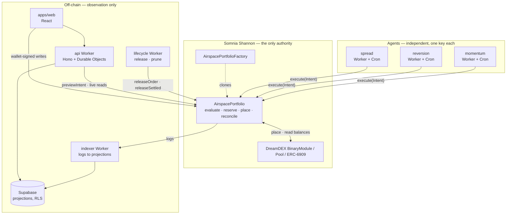
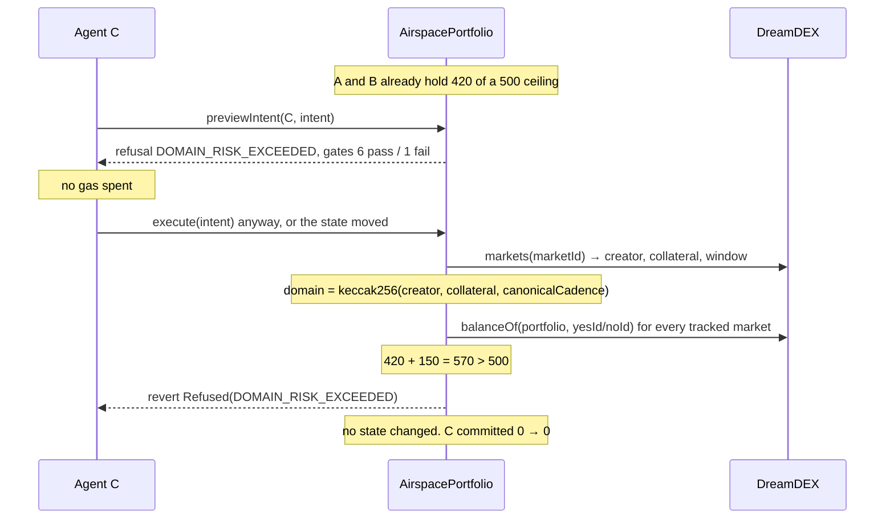
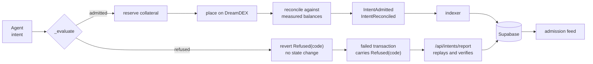

# Architecture

AIRSPACE is one contract that decides, and a stack around it that watches. The
split is absolute: nothing outside the contract can admit, refuse, or move
capital. Everything outside it exists so a person can see what the contract did.

---

## The layers



Two arrows carry authority: an agent calling `execute`, and an owner's wallet
calling a policy or recovery function. Every other arrow is a read or a
projection.

---

## The admission decision

This is the product. Everything else is scaffolding around it.



Seven gates, evaluated in order, short-circuiting at the first failure:

| # | Gate | Asks |
| --- | --- | --- |
| 1 | Agent policy | registered, enabled, off cooldown, nonce fresh, within its own limits |
| 2 | Market trading | not finalized, not resolved, not voided, inside its window |
| 3 | Market generation | the pool's `marketNonce` still matches the intent's |
| 4 | Tick / lot | price on tick, quantity on lot, above minimum |
| 5 | Price ceiling | inside both the global and the agent's price band |
| 6 | Market headroom | enough time left before expiry |
| 7 | **Portfolio domain** | **would this breach a ceiling shared with every other agent** |

Gates 1–6 are about the intent. Gate 7 is about everyone else. A refusal at gate 7
is the only one an agent cannot avoid by writing better code, and it is what
AIRSPACE exists to produce.

The bitmask the contract returns is what the web app renders. Gates after the
blocking one were never evaluated and are shown as "not reached", not as failures.

---

## The contract

`contracts/src/AirspacePortfolio.sol` — 23,689 bytes of runtime, 887 under the
EIP-170 limit.

```
execute(Intent)
  ├─ nonReentrant                       EIP-1153 transient lock
  ├─ e = _evaluate(msg.sender, intent)  the single source of truth
  ├─ if refused → revert Refused(code)  no state touched
  ├─ agentNonce = intent.nonce          replay closed before any external call
  ├─ _commitReservation(agent, i, e)    capital held for what the order will need
  ├─ _place(i, e) → orderId, ExecCtx    pre-balances captured before the venue call
  └─ _reconcile(...)                    measured fills, resting remainder, release
```

`_evaluate` is a non-reverting view. `previewIntent` returns it as a slim
`AdmissionView`; `execute` reverts on its refusal code. One implementation, two
callers — see [DECISIONS.md](DECISIONS.md#4-one-evaluation-path-used-by-both-the-gate-and-the-display).

### Risk domains

```
domain = keccak256(creator, collateral, canonicalCadence)
```

All three inputs are read from the DreamDEX registry during the same call that
uses them. A market minted one second ago lands in the right domain with no owner
transaction and no configuration. This is a **cadence** domain and never an asset:
sibling BTC and ETH 15-minute series from one creator share a ceiling by design,
which is stated in the UI. See
[DECISIONS.md](DECISIONS.md#1-the-risk-domain-is-a-cadence-not-an-asset).

### How exposure is counted

Per market, from ERC-6909 balances at evaluation time:

```
directional = |netYes − netNo|
```

A matched YES/NO pair is a complete set and carries no directional risk, so it
nets out. Across a domain, exposure is the **gross** sum of per-market
directionals — never netted between markets. Being long one series and short
another is two positions, not zero.

Reservations for unfilled orders are added on top, because the risk an order will
create exists from the moment it is admitted. Nothing is accumulated in a counter;
see [DECISIONS.md](DECISIONS.md#2-exposure-is-measured-never-accumulated).

### Lifecycle, all permissionless

`releaseOrder`, `releaseSettled` and `pruneMarket` are callable by anyone and
prove their claim against the venue before freeing anything. A keeper is a
convenience, not a dependency: a stuck reservation overstates usage, which is the
safe direction, and any party can clear it.

---

## Off-chain

### `workers/indexer`

Cron every minute. Reads factory and portfolio logs, writes projections.

Idempotent by construction: every log lands in `chain_events` keyed by
`(chain_id, tx_hash, log_index)`. A replayed block, a retried cron, a duplicate
delivery and a reorg re-scan all converge on the same rows — a duplicate key means
the projection is already applied, so it is skipped rather than repeated.

Logs are processed strictly in `(block, logIndex)` order, because `IntentAdmitted`
carries the order id and `IntentReconciled` carries what actually filled, and they
arrive in that order in one transaction.

Positions are **re-read from the contract** rather than derived from event
arithmetic, mirroring the contract's own measured-not-accumulated rule.

### `workers/api`

Hono on Workers, with one Durable Object per portfolio. The DO holds a 15-second
snapshot and serves a WebSocket. On RPC failure it serves its last good snapshot
tagged `stale: { since, reason }`, and the UI says "Delayed — showing last known
state" rather than showing a stale number as if it were live.

`POST /api/intents/simulate` calls the contract's `previewIntent`. It does not
re-implement a single check.

`POST /api/intents/report` recovers a refusal from a failed transaction. It takes
only a hash and verifies everything against the chain — see
[DECISIONS.md](DECISIONS.md#7-intentrefused-is-unreachable-and-refusals-are-recovered-from-failed-transactions).

No endpoint can move capital or change a policy. There is no backend key with
owner authority.

### `workers/lifecycle`

Cron scans for releasable work and enqueues it; a queue consumer executes it with
retry and a dead-letter queue. Terminal refusals — `OrderStillLive`,
`NothingToRelease`, `MarketNotSettled`, `MarketStillActive`, `NotTracked` — are
successes, not failures: they mean another caller got there first.

### `workers/agent`

Three deployments, three keys, three KV namespaces, no shared state. They discover
markets from the DreamDEX registry rather than from the AIRSPACE indexer, so an
agent keeps trading when this backend is down. See
[docs on the agents](workers/agent/README.md).

### Supabase

Fourteen tables of projections. RLS allows anonymous reads of chain-derived
tables and no writes at all; `users`, `chain_events`, `chain_cursors` and
`reconciliation_jobs` are service-role only. Publishing a projection of public
chain data leaks nothing, and **no value read from this database may authorise an
execution decision**.

`receipts.provenance` labels each field's origin. A value the contract asserted
and a value a worker observed are different kinds of claim and are never rendered
as the same thing.

### `apps/web`

React and Vite, served as static assets from the API Worker, so there is no second
origin and no CORS hop. Every write is a wallet-signed transaction sent straight to
the contract from the browser.

The signature element is the **ceiling line**: domain capacity as stacked segments
attributed per agent against one hard rule. A refused intent draws *past* the line,
so `570 > 500` is something you see rather than read.

Reservations are attributed to the agent that placed them. Filled positions are
pooled ERC-6909 balances that genuinely cannot be attributed to one agent, so they
render as their own segment rather than being guessed at.

---

## Trust boundaries

| Component | Can it move your capital? |
| --- | --- |
| `AirspacePortfolio` | Yes. It holds it. Unaudited. |
| Your owner key | Yes — `withdraw` reads nothing but ownership. |
| A registered agent | Only into orders the contract admits, inside its own policy. |
| The API / indexer / lifecycle Workers | No. No owner authority exists off-chain. |
| Supabase | No. Projections only. |
| The web app | No. It prepares transactions your wallet signs. |

Custody by the contract was forced by the venue, not chosen —
[DECISIONS.md](DECISIONS.md#5-custody-by-the-contract-because-the-venue-leaves-no-choice).

---

## Data flow, end to end



The refused path and the admitted path reach the same feed by different routes,
because a refusal reverts and a revert discards its logs. Both carry `contract`
provenance, because both were re-derived from the chain.

---

## What is deliberately absent

- No off-chain risk engine. `packages/risk` mirrors the contract's arithmetic for
  display and can be deleted without changing what is enforced.
- No admin key, no pause, no upgrade path on a live portfolio.
- No price oracle. AIRSPACE constrains exposure; it does not value it.
- No cross-portfolio state. One Durable Object per portfolio, nothing global.
